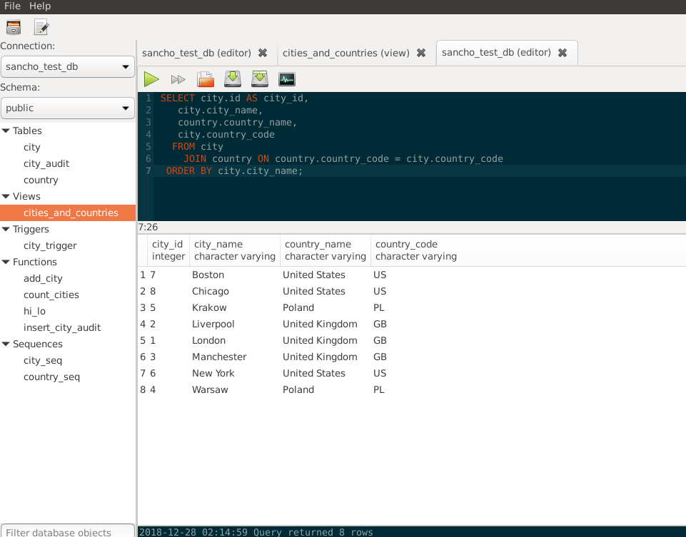

# SanchoSQL - Postgres desktop client for Linux

[SanchoSQL website](https://sanchosql.com)



## Development

[](https://travis-ci.org/lchsk/sanchosql)

## Dependencies

- gtkmm >= 3.18

- gtksourceviewmm-3.0

- libpqxx >= 4.0

### To build

- C++14 compiler

- cmake

- xmllint

On Ubuntu: `sudo apt install libpqxx-dev libgtkmm-3.0-dev libgtksourceviewmm-3.0-dev libxml2-utils`

```
mkdir build
cd build
cmake ..
make -j
./sanchosql
```


